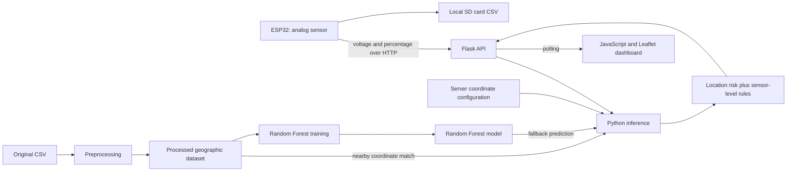

# TT2 — Flood-risk monitoring for Mexico City

An ESP32-to-web prototype that combines sensor readings with geographic flood-risk
scores. A Flask API receives voltage and percentage readings, a Python inference
module combines location risk with sensor level, and a browser dashboard displays
an alert, map, and recent events.

The project demonstrates embedded acquisition, HTTP integration, tabular data
preprocessing, Random Forest regression, and a live web interface. It is a research
prototype; operational flood forecasting and emergency response are outside its
validated scope.

## Architecture



| Component | Implementation |
| --- | --- |
| Device | ESP32 Arduino sketch; WiFi, HTTPClient, SPI, and SD libraries |
| API | Python / Flask; JSON ingestion and coordinate configuration |
| ML and data | scikit-learn, pandas, NumPy, joblib; Matplotlib for training plots |
| Dashboard | HTML, CSS, vanilla JavaScript, Leaflet 1.9.4 from a CDN |
| Development | Ruff, GNU Make, GitHub Actions |

There is no frontend build step or PlatformIO project configuration.

## Local setup

Use **Python 3.11**. The requirements use scikit-learn 1.7.2, the version recorded
in the checked-in model, and NumPy 1.26.4 for its serialized array format. The old
NumPy 1.24.4 pin cannot load the model's `numpy._core` references; NumPy documents
this [pickle compatibility boundary](https://numpy.org/doc/2.0/numpy_2_0_migration_guide.html#note-about-pickled-files).
The remaining direct dependency pins are preserved. Model loading
across scikit-learn versions is [unsupported](https://scikit-learn.org/stable/model_persistence.html).
The original training environment was not fully recorded, so these requirements
are a reproducible starting point for this checkout, not a recovered training lockfile.

From the repository root, create and activate a virtual environment:

**Windows PowerShell**

```powershell
py -3.11 -m venv .venv
.\.venv\Scripts\Activate.ps1
$env:PYTHONUTF8 = "1"
python -m pip install -r requirements-dev.txt
python wsgi.py
```

If PowerShell blocks activation, use `.\.venv\Scripts\python.exe` directly in
place of `python`; changing the system execution policy is unnecessary.

**Linux / macOS**

```bash
python3.11 -m venv .venv
source .venv/bin/activate
python -m pip install -r requirements-dev.txt
python wsgi.py
```

Open **http://localhost:5000**. The dashboard starts in a waiting state until it
receives a reading. The included dataset and model allow a demo without retraining.
For runtime and training dependencies without developer tools, install
`requirements.txt` instead.

`wsgi.py` starts Flask's built-in server with debug disabled. It is a local demo
entry point, not a production WSGI server. It listens on all network interfaces.
The map and Leaflet assets require an internet connection.

### Try it without hardware

In another terminal, send a sample reading:

```powershell
# Windows PowerShell
Invoke-RestMethod -Method Post -Uri http://localhost:5000/ingest -ContentType 'application/json' -Body '{"v":0.8,"pct":75}'
Invoke-RestMethod -Uri http://localhost:5000/api/status
```

```bash
# Linux / macOS
curl -X POST http://localhost:5000/ingest \
  -H 'Content-Type: application/json' -d '{"v":0.8,"pct":75}'
curl http://localhost:5000/api/status
```

These readings use the location currently saved in `src/coords_config.json`.
To test another location, use the dashboard coordinate form. Changes persist in
that file and will appear in `git diff`; review them before committing.

## Configuration

`.env.example` documents the supported variables. **The application does not load
`.env` automatically**; set variables in your shell.

| Setting | Used by | Behavior |
| --- | --- | --- |
| `PORT` | `python wsgi.py` | Port number, default `5000`; debug remains disabled |
| `FLASK_ENV` | `python src/flask_server.py` | `development` enables debug; other values disable it; port is always `5000` |
| `src/coords_config.json` | Flask API | Persisted latitude/longitude; falls back to defaults in `realtime.py` if absent |
| `firmware/arduino_secrets.h` | ESP32 firmware | Local Wi-Fi SSID/password; ignored by Git |

For example, set `$env:PORT = "5050"` in PowerShell or run
`PORT=5050 python wsgi.py` in a POSIX shell. Update client URLs to match.

Each deployed sensor is intended to have a fixed physical location. **The current
API maintains one shared location**, and the firmware payload has no device ID or
coordinates. Independent locations for multiple simultaneous sensors require a
separate implementation; the current coordinate form supports testing one location
at a time.

## ESP32 setup

1. Install the Arduino IDE and the [Espressif ESP32 board package](https://docs.espressif.com/projects/arduino-esp32/en/latest/installing.html).
2. Open `firmware/Sensor.ino`. If the IDE asks to create a matching sketch folder, ensure
   the sketch and local secrets header both reside in the resulting `Sensor` folder.
3. Copy `firmware/arduino_secrets.h.example` to `firmware/arduino_secrets.h` beside the sketch and
   fill in your Wi-Fi credentials. Only the example belongs in version control.
4. Configure `LAPTOP_IP` and `HTTP_PORT` in the sketch for the computer running
   Flask. The device must be able to reach that address on the network.
5. Select your actual ESP32 board and serial port, then compile and upload.

The sketch uses ADC GPIO 35, SD chip-select GPIO 5, and a configured 150-ohm shunt
for the 4–20 mA sensor conversion. Confirm the wiring and ADC voltage limits for
your actual board. Readings are appended to `/datos.csv` on the SD card and posted
to `/ingest` approximately every ten seconds, plus acquisition and request time.

The repository does not specify an exact board identifier or ESP32 core version;
firmware compilation is not part of the Python CI workflow.

## Data and model

The original CSV contains 612 rows. Preprocessing maps rainfall and floodable-area
categories to numbers and removes duplicates, producing 306 geographic rows.
The target is a constructed score:

```text
risk score = 0.6 × rainfall midpoint + 0.4 × floodable-area midpoint
```

`train_model.py` trains a `RandomForestRegressor` with latitude/longitude as inputs,
100 trees, maximum depth 10, and random seed 42, using an 80/20 split. It prints
MSE and R² and displays a prediction plot. The target is not an observed flood
outcome, and no independent field-validation accuracy is claimed.

At inference time, `realtime.py` first checks the processed dataset within
±0.0001 degrees in both coordinates and uses the first match. It uses the model
when there is no match. Risk bands and the sensor level then determine the alert.
Coordinates outside the configured Mexico City bounds produce a warning; they
are not rejected.

To regenerate artifacts deliberately:

```bash
# From the repository root, with the environment activated
cd src
python process_dataset.py
python train_model.py
```

Preprocessing replaces `src/processed_dataset.csv`. Training replaces
`src/predictive_model.pkl` **after the plot window closes**. These generated files
remain tracked because the demo depends on them. Only load a trusted model file:
joblib serialization can execute code during loading.

## Development commands

GNU Make is optional. Activate the environment before invoking it. An alternative
interpreter can be selected with `make PYTHON=python3.11 lint`.

| Target | Purpose |
| --- | --- |
| `make install` | Install runtime/training dependencies |
| `make install-dev` | Install runtime dependencies and Ruff |
| `make run` | Run `wsgi.py` |
| `make test` | Execute the three existing diagnostic scripts as smoke checks |
| `make lint` | Run Ruff lint and formatting checks |
| `make format` | Apply Ruff formatting only |
| `make preprocess` | Regenerate the processed dataset |
| `make train` | Train and replace the model; close the plot to finish |

Without Make, the checks are:

```bash
python -m ruff check .
python -m ruff format --check .
python tests/test_fix.py
python tests/test_specific_coordinates.py
cd src
python ../tests/test_correction.py
```

The current diagnostic scripts **do not assert expected results or fail on an
incorrect prediction**. CI runs them to catch execution/import failures, alongside
lint and formatting checks, on pushes and pull requests. A green workflow does not
establish prediction accuracy. See [diagnostic details](tests/README.md).

Ruff preserves existing unused imports and literal f-strings in this formatting
pass; the documented exceptions in `pyproject.toml` avoid changing execution
behavior. Test consolidation and stronger regression checks remain separate work.

## API and repository map

| Route | Purpose |
| --- | --- |
| `GET /` | Dashboard |
| `POST /ingest` | Accept numeric `v` and `pct`; compute current alert |
| `GET /api/status` | Most recent result, or waiting state |
| `GET /api/coords` | Current shared coordinates |
| `POST /api/coords` | Accept `lat` and `lon`, persist configuration |

```text
firmware/Sensor.ino            ESP32 firmware
firmware/arduino_secrets.h.example  Wi-Fi configuration template
scripts/Start-PublicServer.ps1 Windows PowerShell launcher
scripts/start_with_cloudflare.bat  Windows batch launcher
wsgi.py                       Local server entry point / exported WSGI app
src/flask_server.py            API and coordinate persistence
src/realtime.py                Dataset lookup, inference, and alert rules
src/process_dataset.py         Dataset preparation
src/train_model.py             Random Forest training
src/templates/                Dashboard HTML
src/static/                   JavaScript and CSS
src/*.csv, src/*.pkl           Demo data and trained model
src/coords_config.json        Shared location configuration
tests/                        Existing diagnostic scripts, including test_fix.py
.github/workflows/ci.yml       Python quality and smoke checks
```

The latest API result is held in server memory; dashboard history is held in the
browser page and resets on reload. There is no authentication, per-device storage,
or durable event service. Input validation is limited: `/ingest` currently returns
`ok` even when a payload is ignored. Public exposure needs a separate access-control
and deployment review.

More detail: [dashboard](src/DASHBOARD_README.md),
[temporary sharing](PUBLIC_SERVER_QUICKSTART.md),
[Cloudflare setup](CLOUDFLARE_SETUP.md).

## License

The project code is available under the [MIT license](LICENSE). The repository
does not currently document the original dataset's source or redistribution terms;
verify those terms before redistributing the data or making provenance claims.
